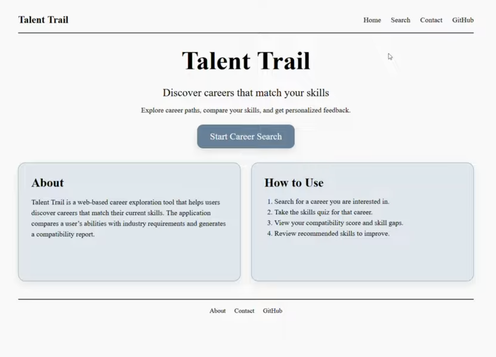
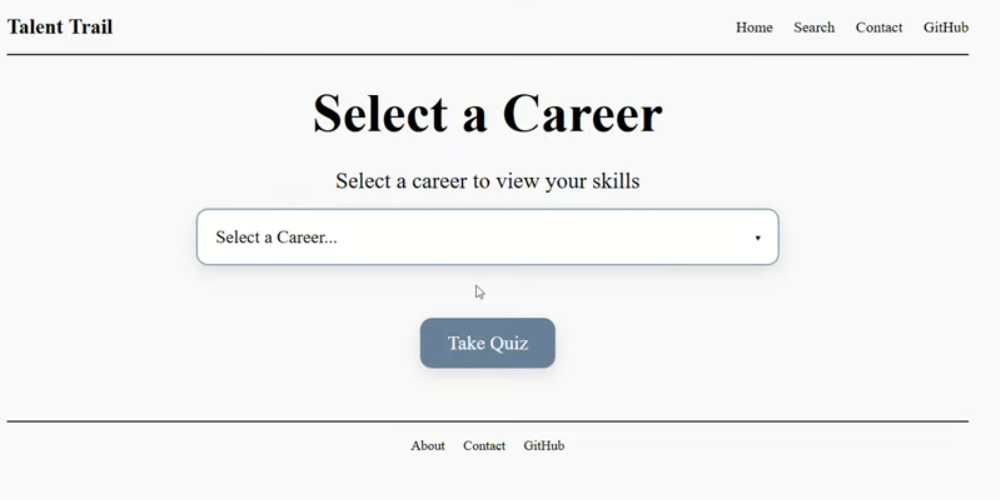
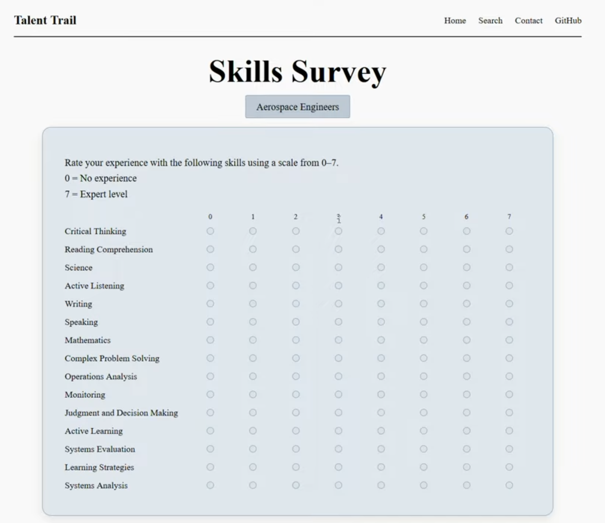
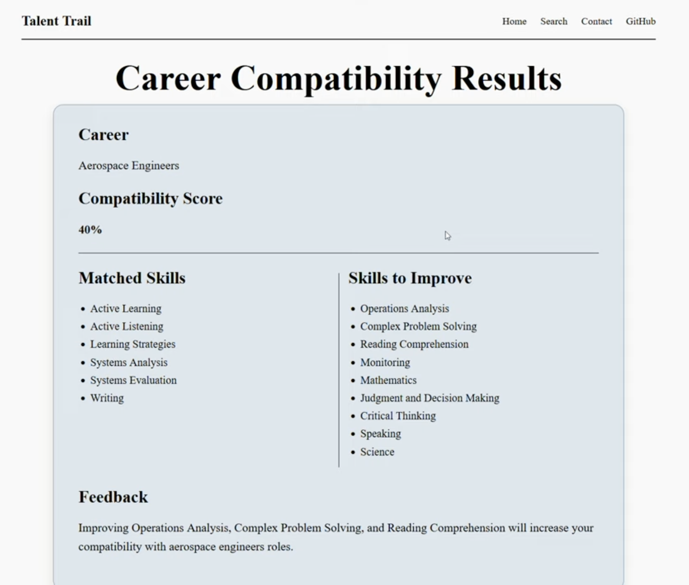

# Talent Trail
A career exploration and skill gap analysis web application built using Flask, SQLite, and O*NET occupational data.
## Description
As the Front-End Developer and UI/UX Designer for the project, I focused on:
- Designing the user interface and page layouts
- Creating responsive front-end components
- Styling the application using HTML and CSS
- Improving user navigation and usability
- Collaborating with teammates on feature integration and testing

Many people struggle to evaluate their skill sets and develop a clear plan to reach their career goals. Talent Trail simplifies this process by combining official O*NET data with user input, producing an intuitive analysis of career readiness.  

---

## Team Members
- **Sarah Suliman** (GitHub: `sssuliman`, Email: Sarah.Suliman@colorado.edu)
- **Lisa Wilder** (GitHub: `Wilder407`, Email: Lisa.Wilder@colorado.edu)
- **Kassidy Flick** (GitHub: `kflick3r`, Email: kassidy.flick@colorado.edu)
- **Mark Olmscheid** (GitHub: `Olmscheid`, Email: Mark.Olmscheid@colorado.edu)

---

## User Flow
1. User lands on homepage
2. User selects career from searchable dropdown
3. Backend retrieves:
- Career description
- Required skills list
4. User completes survey (1–7 scale)
5. Backend:
- Calculates match percentage
- Identifies missing skills
6. Results page displays:
- Match percentage
- Skills the user possesses
- Skills that need improvement
- Button to generate PDF
7. PDF of report is generated and downloaded

---
## Screenshots

### Homepage

### Career Selection

### Skills Survey

### Career Compatibility Results

---

## Demo Video: 
https://youtu.be/zIh3MUsDnYw

---

## Live Demo  
The project is deployed using Render:  

https://talent-trail.onrender.com  

You can access the full working version of Talent Trail without running it locally.  

---

## Tech Stack
- Backend: Python, Flask
- Database: SQLite 
- Frontend: HTML, CSS
- Version Control: Github
- PDF Generation: Generate HTML and Convert to PDF (WeasyPrint)

---

## Installation / Usage
1. Clone the repository:  
   `git clone https://github.com/sssuliman/Suliman_Talent_Trail.git` 
   `cd Talent_Trail`  
2. Create and activate a virtual environment
   `source venv/bin/activate`  
3. Ensure the O*NET database is located at Data/onet.db  
4. Run the Flask development server:  
   `python app.py`
   
#### Accessing the App  
###### Local IDE:  

Open your browser at http://localhost:5000  

###### JupyterHub:  

Open your browser at your JupyterHub service URL (usually includes `/proxy/5000/`)  
The exact URL may vary depending on your JupyterHub setup  

---

## Major Features
- Career selection from O*NET database with top skills for each career
- User skill self-assessment (1–7 scale)
- Weighted skill gap analysis using O*NET Level & Importance ratings
- Match percentage calculation for each career
- PDF report generation with skills, gaps, and compatibility score

---

## How to Use
1. Select a career from the dropdown menu
2. Rate your current proficiency in the top skills for that career
3. Submit the survey to generate a results page:
 - Displays match percentage
 - Lists skills you possess and skills to improve
4. Download a PDF report for your records
  
**Note:** The MVP currently does not include previous experience or education in compatibility scoring or final reports.

---

## Acknowledgements
- O*NET Online - For providing occupational data and skill ratings
    - Website: https://www.onetonline.org
- Open-source libraries: Flask, Python, WeasyPrint, SQLite

---

## Future Development Possibilities
| Feature                                      | Description                                                             | Benefit                                                                  |
| -------------------------------------------- | ----------------------------------------------------------------------- | ------------------------------------------------------------------------ |
| Trie Tree Career Selection                   | Replace career selection dropdown with a Trie Tree algorithm            | Faster and more intuitive career search; improves user experience        |
| Skill Categories                             | Organize skills into Technical, Soft Skills, Education, Experience      | Provides a more detailed and meaningful analysis of user skills          |
| Career Progress Tracking                     | Track user progress across multiple sessions                            | Supports long-term skill development and repeated assessments            |
| Multi-Career Comparison                      | Compare user skills across multiple careers                             | Helps users explore alternative career paths and make informed decisions |
| Incorporate Experience & Education           | Include previous work experience and education in compatibility scoring | Produces a more holistic and accurate assessment of career readiness     |
| Education Distribution Visualization         | Display typical education distribution for selected careers             | Helps users understand common career paths and educational requirements  |
| User Accounts & Saved Reports                | Enable login and report saving for multiple sessions                    | Supports long-term tracking and personalized planning                    |